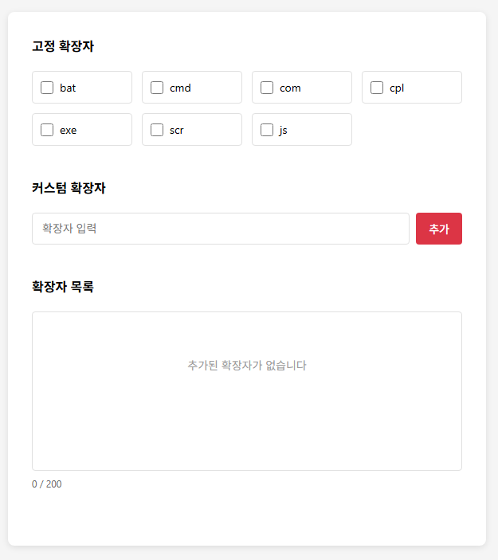

# 지원자: 장원선
# 프로젝트 개요
플로우 개발자 채용 과제인 파일 확장자 차단 프로젝트를 구현했습니다.
서버뿐만 개발한 것이 아닌 화면 호출까지 개발하였습니다.

# 주요 기능

💳 고정 확장자 체크 : 기본적으로 고정된 확장자들의 체크방식을 DB에 저장하고 새로고침 시 유지하도록 구현했습니다. 
💳 커스텀 확장자 등록 , 삭제 구현 : 사용자가 등록하고싶은 확장자를 입력 후 등록하고 삭제할 수 있도록 구현했습니다.  
💳 커스텀 확장자 Validation 체크 : 커스텀 확장자 등록 시 최대 글자 수(20자) , 최대 등록 개수 (200개) , 중복 체크를 구현했습니다. 
클라이언트단에서만 체크하는것이 아닌 서버에서도 이중으로 체크합니다.

# 기술 스택
- 언어 : JAVA 21
- 프레임워크 : Spring Boot 3.5.6
- DB : PostgreSQL 17.4 (supabase)
- ORM: JPA
- 개발 및 유틸리티(AI) : Lombok , Claude

# 과제 기본 요구사항
- 고정 확장자는 차단을 자주하는 확장자를 리스트이며, default는 unCheck되어져 있습니다.
- 고정 확장자를 check or uncheck를 할 경우 db에 저장됩니다. - 새로고침시 유지되어야합니다.
- 확장자 최대 입력 길이는 20자리
- 추가버튼 클릭시 db 저장되며, 아래쪽 영역에 표현됩니다.
- 커스텀 확장자는 최대 200개까지 추가가 가능
- 확장자 옆 X를 클릭시 db에서 삭제
# 개인적인 추가 요구사항
- 커스텀 확장자 이름 중복 체크 (toLowerCase를 활용하여 소문자를 기준으로 체크)
- 클라이언트에서만 validation 체크를 하는 것이 아닌 서버에서도 체크하도록 구현

### 주요 API 엔드포인트
- MainController  
GET / - index.html파일로 이동 (확장자 화면 구현)

- ExtensionController /api/v1/extension  
POST - 커스텀 확장자 생성
DELETE /{id} - 커스텀 확장자 삭제
PATCH /{id} - 고정 확장자 체크 설정

# 접속 방법
아래 주소로 접속하시면 됩니다.
http://34.47.74.23:8082/

감사합니다.